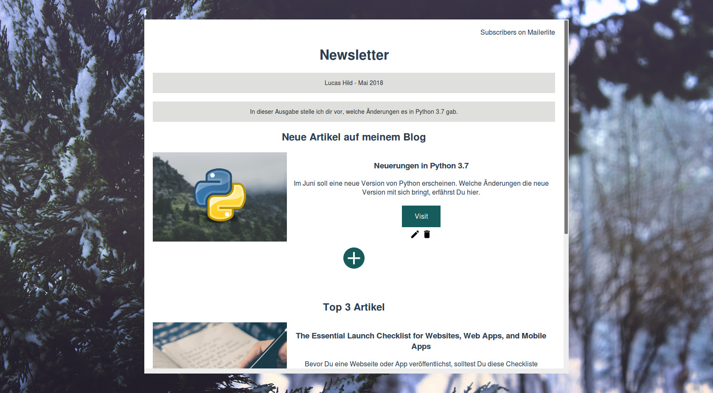

# Newsletter

The frontend and backend that let me create and send e-mail newsletters via Mailerlite. The frontend is powered by Vue.js and the backend runs on Flask.



## Installation

```
cd frontend
npm install

cd backend
pip install -r requirements.txt
```

## Development

```
cd frontend
npm run dev

cd backend
flask run
```

## Made with

- [Vue.js](https://vuejs.org) - web framework
- [axios](https://github.com/axios/axios) - http client
- [Flask](http://flask.pocoo.org) - microframework for api

## Meta

Lucas Hild - https://lucas-hild.de
This project is licensed under the MIT License - see the LICENSE file for details
